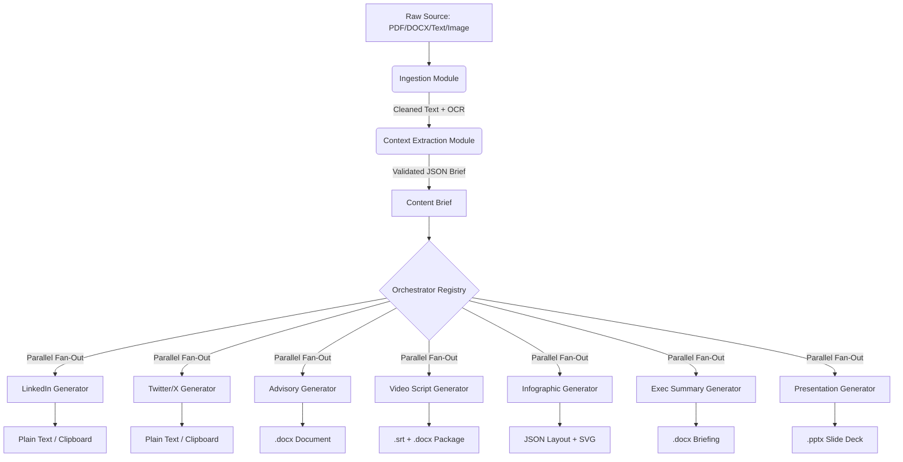
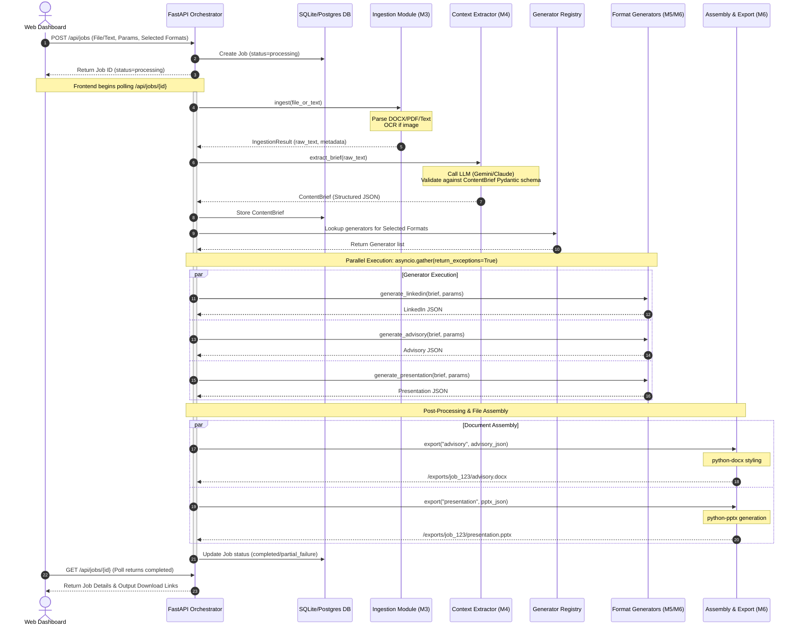

# System Architecture Document
## Gen AI Platform for Automated Content Transformation (SIH 2026 - Problem Statement 26154)

---

## 1. Executive Summary & Design Philosophy

The **Gen AI Platform for Automated Content Transformation** is a production-grade, async-native system designed to convert heterogeneous source documents (PDFs, DOCX, Plain Text, Images) into multiple consistent communication artifacts (LinkedIn posts, Twitter threads, structured advisories, video scripts, infographics, executive summaries, and presentation decks) simultaneously.

### Core Architectural Principle: The Content Brief Pattern
To ensure absolute factual consistency across multiple generated outputs and to keep the platform highly extensible, we enforce the **Content Brief Pattern**:
1. **No direct prompt ingestion**: Individual format generators *never* receive raw source content.
2. **Intermediate representation**: Raw inputs are processed by an Ingestion layer, then consolidated into a structured, validated, and domain-classified JSON object called the `ContentBrief`.
3. **Structured fan-out**: The `ContentBrief` is distributed in parallel to registered generators along with user-specified styling parameters.
4. **Decoupled extensibility**: Adding a new output format requires no changes to ingestion, parsing, or brief extraction logic. You simply write a new generator function, register it in the Generator Registry, and define its Pydantic output schema.



---

## 2. Dynamic Flow & Sequence

Below is the execution flow from the moment an operator uploads a source document and clicks **Generate** on the Dashboard.



---

## 3. Modular System Decomposition

The system is organized into self-contained modules, each with isolated responsibilities and strict interface contracts.

### 3.1 Ingestion Module (M3)
*   **Role**: Converts raw files or pasted text into clean, structured text.
*   **Capabilities**:
    *   **Text/Markdown**: Clean, sanitize, check minimum length (50 chars).
    *   **DOCX**: Extract paragraphs, tables, lists using `python-docx`.
    *   **PDF**: Process page-by-page using `pdfplumber` (preserves layout/tables better than standard PyPDF).
    *   **Images**: Check image type. If text-heavy (document/screenshot), execute OCR via `pytesseract`. If visual (diagram, graph, scene), invoke a multimodal LLM vision call (Gemini Flash vision) to extract a detailed textual description of the visual facts.
*   **Interface Contract**:
    ```python
    class IngestionResult(BaseModel):
        source_type: str  # "pdf" | "docx" | "text" | "image"
        raw_text: str
        metadata: dict

    def ingest(file_or_text: Union[UploadFile, str]) -> IngestionResult:
        ...
    ```

### 3.2 Context Extraction Module (M4)
*   **Role**: Condenses raw ingested text into the single source of truth (`ContentBrief`).
*   **Core Logic**: Prompts a highly reasoning LLM (Gemini 2.5 Flash / Claude) using schema enforcement to extract key facts, entities, domains, urgency levels, recommended actions, and sentiment.
*   **JSON Schema Validation**: Uses Pydantic to validate the LLM's response. If parsing fails (invalid JSON or missing fields), a retry mechanism corrects the structure.
*   **Content Brief Schema**:
    ```python
    class ContentBrief(BaseModel):
        topic: str
        summary: str
        key_facts: list[str]
        entities: list[str]
        domain: Literal["cybersecurity", "policy", "health", "general", "other"]
        urgency_level: Literal["low", "medium", "high", "critical"]
        recommended_actions: list[str]
        sentiment: Literal["neutral", "positive", "negative", "alarming"]
    ```

### 3.3 Format Generators (M5 & M6)
*   **Role**: Convert the `ContentBrief` and `GenerationParams` into format-specific outputs.
*   **Strategy**: All generators implement a standard interface. They leverage targeted system instructions, parameter mappings (e.g., matching the tone "formal" or "urgent"), and enforce structured JSON returns matching specific Pydantic schemas.
*   **Output Schemas**:
    *   `LinkedInOutput`: `{ post_body: str, hashtags: list[str], recommended_visual_concept: str }`
    *   `TwitterOutput`: `{ thread: list[str], engagement_question: str }`
    *   `AdvisoryOutput`: `{ title: str, summary: str, threat_details: str, impact_analysis: str, recommended_actions: list[str], contact_info: str }`
    *   `VideoOutput`: `{ title: str, target_duration_seconds: int, storyboard_scenes: list[{ scene_number: int, visual_description: str, narration_text: str, subtitle_text: str, duration_seconds: int }] }`
    *   `InfographicOutput`: `{ title: str, layout_type: Literal["hierarchical", "timeline", "two_column", "grid"], content_blocks: list[{ header: str, content: str, icon_suggestion: str, color_weight: str }] }`
    *   `ExecSummaryOutput`: `{ title: str, executive_takeaway: str, situational_brief: str, operational_impacts: list[str], strategic_recommendations: list[str] }`
    *   `PresentationOutput`: `{ title: str, subtitle: str, slides: list[{ slide_number: int, title: str, bullet_points: list[str], speaker_notes: str, visual_layout_guideline: str }] }`

### 3.4 Assembly & Export Module (M6)
*   **Role**: Converts JSON generator outputs into standard download formats.
*   **Implementations**:
    *   **DOCX Export** (`python-docx`): Inject title, paragraphs, headers, and bullet points into a clean, pre-styled template containing a professional header/footer.
    *   **PPTX Export** (`python-pptx`): Build slide layouts (Title slide, Content slides) with consistent fonts (e.g., Arial or Calibri), margins, bullet points, and speaker notes.
    *   **SRT Export** (Custom script): Extract subtitle strings from the Video JSON and construct a valid time-stamped `.srt` file.

---

## 4. Database Schema

For local development, we use SQLite, transitionable to Supabase (PostgreSQL) for production.

```sql
-- Track jobs submitted by operators
CREATE TABLE jobs (
    id TEXT PRIMARY KEY,
    status TEXT NOT NULL,          -- 'processing', 'completed', 'partial_failure', 'failed'
    created_at TIMESTAMP DEFAULT CURRENT_TIMESTAMP,
    updated_at TIMESTAMP DEFAULT CURRENT_TIMESTAMP,
    source_type TEXT NOT NULL,     -- 'text', 'file_pdf', 'file_docx', 'file_image'
    parameters TEXT NOT NULL,      -- JSON representation of GenerationParams
    content_brief TEXT             -- JSON representation of ContentBrief (once extracted)
);

-- Track individual format generation outputs for each job
CREATE TABLE outputs (
    id TEXT PRIMARY KEY,
    job_id TEXT NOT NULL,
    output_type TEXT NOT NULL,     -- 'linkedin', 'twitter', 'advisory', 'video', 'infographic', 'exec_summary', 'presentation'
    status TEXT NOT NULL,          -- 'processing', 'success', 'failed'
    content TEXT,                  -- JSON string of the structured generator response
    file_path TEXT,                -- Path to the assembled export file (if applicable)
    error_message TEXT,            -- Diagnostic error if status is failed
    FOREIGN KEY(job_id) REFERENCES jobs(id) ON DELETE CASCADE
);
```

---

## 5. Technical Stack

| Layer | Component | Selection | Rationale |
|---|---|---|---|
| **Frontend** | Framework | React 18+ (Vite) | High performance, rich component ecosystem, quick development. |
| | Styling | Tailwind CSS | Utility-first approach for rich, responsive, modern custom styling (dark mode, grids). |
| | Icons | Lucide React | Clean, scalable vector icons matching modern UI guidelines. |
| **Backend** | Framework | FastAPI (Python 3.10+) | Async-native, automated OpenAPI docs, native integration with Pydantic. |
| | ORM | SQLAlchemy / SQLModel | Quick schema mapping for SQLite/Postgres. |
| **Parsing** | PDF | `pdfplumber` | Extracts structured text and retains spatial layout better than competitors. |
| | Word | `python-docx` | Native XML parsing for Word documents without MS Word dependency. |
| | OCR | `pytesseract` | Free, robust local OCR engine for text extraction from screenshots/images. |
| **Export** | PPTX Generator | `python-pptx` | Native creation of MS PowerPoint files from backend models. |
| | Word Styling | `python-docx` | Builds styled headings, tables, and lists. |
| **AI Orchestration** | Model APIs | Google Gemini API (Gemini 2.5 Flash / Pro) | Generous free tier context, fast execution, excellent structured JSON schema adherence. |
| | Validation | Pydantic v2 | Robust runtime type-checking and schema validation of LLM outputs. |

---

## 6. Execution Optimization & Fault Tolerance

1.  **Parallel Generation**: When an operator selects multiple formats, the Orchestrator initiates parallel threads via:
    ```python
    tasks = [generate_format(output_type, brief, params) for output_type in selected_types]
    results = await asyncio.gather(*tasks, return_exceptions=True)
    ```
    If one LLM call times out or fails validation, `return_exceptions=True` catches the error. The system marks only *that specific output* as `failed` in the database, continuing to successfully generate and build all other requested formats.
2.  **Schema Enforcement**: All prompts explicitly instruct the model to output a strict JSON structure and specify that no preamble, markdown wrapping, or explanations should be returned. If validation fails, the orchestrator immediately triggers a single self-correction loop, supplying the validation error message back to the LLM to get it to correct the formatting.
3.  **Low-Latency Performance**: By running ingestion locally, extracting context in a single call, and executing all downstream formats in parallel, a complete multi-format job can comfortably finish in under 20–25 seconds.
